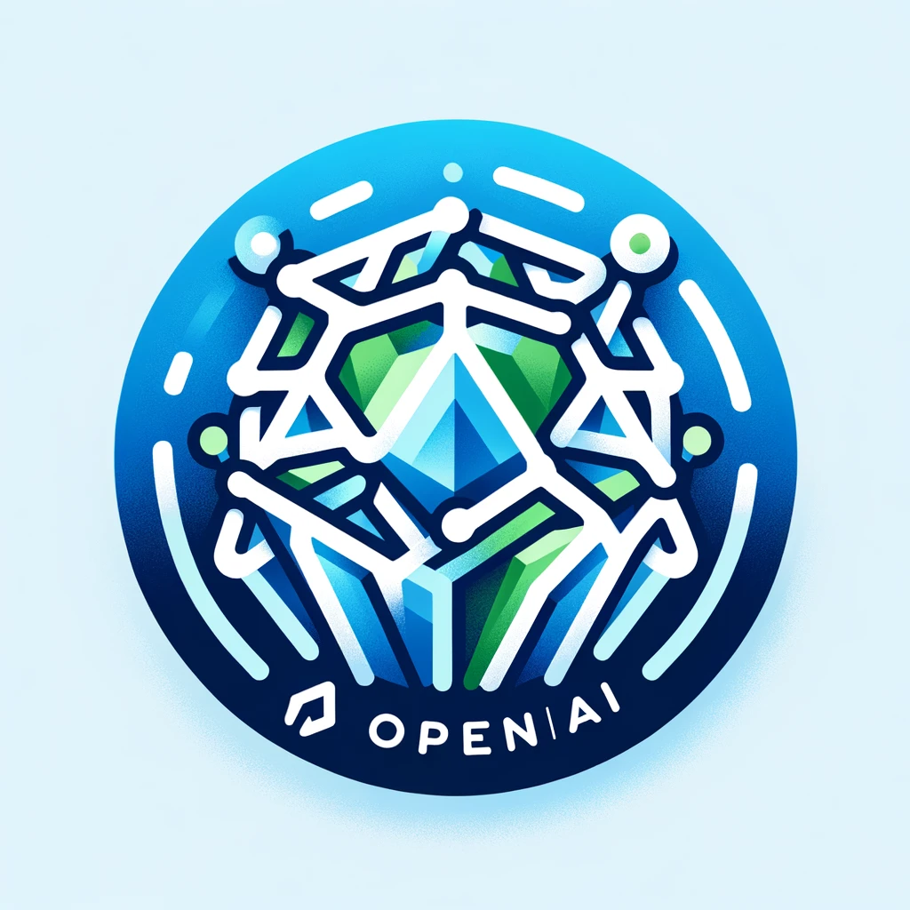

# openaiAPI



OpenAI library for Crystal, providing an interface to interact with various OpenAI services.

## Features

- [x] Authentication
- Engine Interaction
  - [x] List available engines.
  - [ ] Retrieve details about a specific engine.
- [x] Completion Requests
  - [x] Create completions.
  - [ ] Retrieve a specific completion.
- [x] Error Handling
  - [ ] Implement robust error handling for different scenarios.
- [ ] Usage Information
  - [ ] Provide methods to retrieve API usage information.
- [ ] Documentation and Examples
  - [ ] Include comprehensive documentation and example code for each function.
- [ ] Testing
  - [ ] Write unit tests to cover the main functionality.

## Installation

1. Add the dependency to your `shard.yml`:

   ```yaml
   dependencies:
     openai:
       github: dmarshaltu/openai
   ```

2. Run `shards install`

## Usage

```crystal
require "openai"


OPENAI_KEY = api_key().to_s
client = OpenAI::Client.new(OPENAI_KEY)

# Example usage: List available models
begin
  models = client.list_models
rescue OpenAI::AuthenticationError
  puts "Authentication failed: Check your API key."
end

# Define your messages array
messages = [
  {"role" => "system", "content" => "You are a helpful assistant."},
  {"role" => "user", "content" => "Tell me a joke."}
]

model = "gpt-3.5-turbo"
max_tokens = 150

response = client.create_chat_completion(messages, model, max_tokens)
puts response

```

response:

```bash
"OPENAI_KEY"
2024-01-11T14:13:52.075201Z  DEBUG - http.client: Performing request -- method: "GET", host: "api.openai.com", port: 443, resource: "/v1/engines"
{
  "object": "list",
  "data": [
    {
      "object": "engine",
      "id": "gpt-4-0613",
      "ready": true,
      "owner": "openai",
      "permissions": null,
      "created": null
    },
    {
      "object": "engine",
      "id": "curie-search-query",
      "ready": true,
      "owner": "openai-dev",
      "permissions": null,
      "created": null
    },
    {
      "object": "engine",
      "id": "gpt-4",
      "ready": true,
      "owner": "openai",
      "permissions": null,
      "created": null
    },
    {
      "object": "engine",
      "id": "babbage-search-query",
      "ready": true,
      "owner": "openai-dev",
      "permissions": null,
      "created": null
    },
    {
      "object": "engine",
      "id": "gpt-4-1106-preview",
      "ready": true,
      "owner": "system",
      "permissions": null,
      "created": null
    },
    {
      "object": "engine",
      "id": "babbage-search-document",
      "ready": true,
      "owner": "openai-dev",
      "permissions": null,
      "created": null
    },
    {
      "object": "engine",
      "id": "dall-e-2",
      "ready": true,
      "owner": "system",
      "permissions": null,
      "created": null
    },
    {
      "object": "engine",
      "id": "gpt-3.5-turbo-0301",
      "ready": true,
      "owner": "openai",
      "permissions": null,
      "created": null
    },
    {
      "object": "engine",
      "id": "gpt-3.5-turbo-16k-0613",
      "ready": true,
      "owner": "openai",
      "permissions": null,
      "created": null
    },
    {
      "object": "engine",
      "id": "text-embedding-ada-002",
      "ready": true,
      "owner": "openai-internal",
      "permissions": null,
      "created": null
    },
    {
      "object": "engine",
      "id": "davinci-search-query",
      "ready": true,
      "owner": "openai-dev",
      "permissions": null,
      "created": null
    },
    {
      "object": "engine",
      "id": "gpt-3.5-turbo-instruct",
      "ready": true,
      "owner": "system",
      "permissions": null,
      "created": null
    },
    {
      "object": "engine",
      "id": "gpt-3.5-turbo-16k",
      "ready": true,
      "owner": "openai-internal",
      "permissions": null,
      "created": null
    },
    {
      "object": "engine",
      "id": "whisper-1",
      "ready": true,
      "owner": "openai-internal",
      "permissions": null,
      "created": null
    },
    {
      "object": "engine",
      "id": "ada-search-document",
      "ready": true,
      "owner": "openai-dev",
      "permissions": null,
      "created": null
    },
    {
      "object": "engine",
      "id": "gpt-3.5-turbo-0613",
      "ready": true,
      "owner": "openai",
      "permissions": null,
      "created": null
    },
    {
      "object": "engine",
      "id": "ada-code-search-code",
      "ready": true,
      "owner": "openai-dev",
      "permissions": null,
      "created": null
    },
    {
      "object": "engine",
      "id": "davinci-002",
      "ready": true,
      "owner": "system",
      "permissions": null,
      "created": null
    },
    {
      "object": "engine",
      "id": "gpt-3.5-turbo-instruct-0914",
      "ready": true,
      "owner": "system",
      "permissions": null,
      "created": null
    },
    {
      "object": "engine",
      "id": "babbage-002",
      "ready": true,
      "owner": "system",
      "permissions": null,
      "created": null
    },
    {
      "object": "engine",
      "id": "gpt-4-vision-preview",
      "ready": true,
      "owner": "system",
      "permissions": null,
      "created": null
    },
    {
      "object": "engine",
      "id": "davinci-search-document",
      "ready": true,
      "owner": "openai-dev",
      "permissions": null,
      "created": null
    },
    {
      "object": "engine",
      "id": "curie-search-document",
      "ready": true,
      "owner": "openai-dev",
      "permissions": null,
      "created": null
    },
    {
      "object": "engine",
      "id": "gpt-3.5-turbo",
      "ready": true,
      "owner": "openai",
      "permissions": null,
      "created": null
    },
    {
      "object": "engine",
      "id": "ada-search-query",
      "ready": true,
      "owner": "openai-dev",
      "permissions": null,
      "created": null
    },
    {
      "object": "engine",
      "id": "ada-code-search-text",
      "ready": true,
      "owner": "openai-dev",
      "permissions": null,
      "created": null
    },
    {
      "object": "engine",
      "id": "tts-1-hd",
      "ready": true,
      "owner": "system",
      "permissions": null,
      "created": null
    },
    {
      "object": "engine",
      "id": "dall-e-3",
      "ready": true,
      "owner": "system",
      "permissions": null,
      "created": null
    },
    {
      "object": "engine",
      "id": "gpt-3.5-turbo-1106",
      "ready": true,
      "owner": "system",
      "permissions": null,
      "created": null
    },
    {
      "object": "engine",
      "id": "tts-1-hd-1106",
      "ready": true,
      "owner": "system",
      "permissions": null,
      "created": null
    },
    {
      "object": "engine",
      "id": "tts-1-1106",
      "ready": true,
      "owner": "system",
      "permissions": null,
      "created": null
    },
    {
      "object": "engine",
      "id": "tts-1",
      "ready": true,
      "owner": "openai-internal",
      "permissions": null,
      "created": null
    },
    {
      "object": "engine",
      "id": "gpt-4-0314",
      "ready": true,
      "owner": "openai",
      "permissions": null,
      "created": null
    }
  ]
}
2024-01-11T14:13:52.889580Z  DEBUG - http.client: Performing request -- method: "POST", host: "api.openai.com", port: 443, resource: "/v1/chat/completions"
{text: "Sure, here's a classic one for you: \n\nWhy don't scientists trust atoms? \n\nBecause they make up everything!", id: "chatcmpl-8fq6bn9amQ58M942YLnTDUtvS62TV"}

```

## Development

TODO: Write development instructions here

## Contributing

1. Fork it (<https://github.com/dmarshaltu/openai/fork>)
2. Create your feature branch (`git checkout -b my-new-feature`)
3. Commit your changes (`git commit -am 'Add some feature'`)
4. Push to the branch (`git push origin my-new-feature`)
5. Create a new Pull Request

## Contributors

- [dmarshaltu](https://github.com/dmarshaltu) - creator and maintainer
